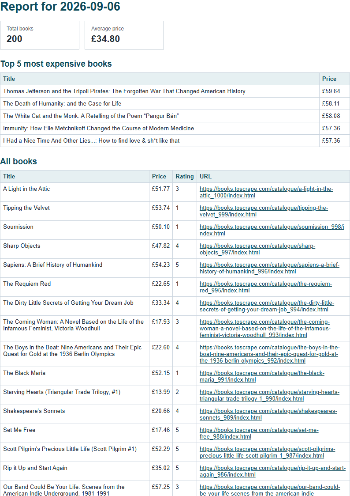

# PoliteScraper

Polite scraping pipeline that turns HTML into JSON records while keeping the learning scope small and deliberate.

This project collects a small, local report from the Books to Scrape learning dataset, stores normalized books in SQLite, and renders a linked HTML-to-PDF report. Generated `report.db` and `reports/` files are local runtime artifacts and are ignored by Git.

## Dataset and setup

The dataset is the first 200 books from [Books to Scrape](https://books.toscrape.com/), an explicitly provided web-scraping sandbox. The scraper stores title, price, availability, star rating, product URL, description, source page, and fetch time in `output/books.json`.

Install dependencies and seed the local database:

```powershell
npm install
npm run seed
```

Run the aggregation report, create a PDF, or start the HTTP server:

```powershell
npm run report
npm run pdf
npm start
```

The server exposes `GET /health`, `POST /reports`, `GET /reports/:id`, and `GET /reports/:id/file`. A same-day repeated POST reuses the existing report and returns `200` instead of generating a second PDF.

## Aggregated SQL

The report uses these SQLite queries:

```sql
SELECT COUNT(*) AS total_orders FROM orders;

SELECT COALESCE(SUM(amount), 0) AS total_revenue FROM orders;

SELECT product, SUM(amount) AS revenue
FROM orders
GROUP BY product
ORDER BY revenue DESC
LIMIT 5;

SELECT date(ordered_at) AS day, COUNT(*) AS orders
FROM orders
WHERE date(ordered_at) >= date('now', '-6 days')
GROUP BY day
ORDER BY day;

SELECT COUNT(*) AS total_books FROM books;

SELECT AVG(price) AS average_price FROM books;

SELECT id, title, price, rating, url
FROM books
ORDER BY price DESC
LIMIT 5;

SELECT rating, COUNT(*) AS books
FROM books
GROUP BY rating
ORDER BY rating;
```

## POST-to-download proof

With the server running, report generation waits for the PDF and returns a link:

```powershell
curl.exe -i -X POST http://localhost:3000/reports
HTTP/1.1 201 Created
{"id":1,"file":"/reports/1/file"}

curl.exe -i http://localhost:3000/reports/1
HTTP/1.1 200 OK
{"id":1,"path":"reports/1.pdf","created_at":"2026-09-06T10:39:48.537Z","file":"/reports/1/file"}

curl.exe -o my-report.pdf http://localhost:3000/reports/1/file
```

The downloaded file is a real PDF beginning with the `%PDF` signature. A second POST on the same day returns `200` with the same ID and link.



A small learning scraper for the Books section of the ToScrape Web Scraping Sandbox.

The requested `toscreape.com` address did not resolve. The related working site, `toscrape.com`, describes itself as a “Web Scraping Sandbox” and says its Books target is a fictional bookstore that wants to be scraped. It lists 1,000 items, pagination, up to 20 items per page, and no JavaScript requirement.

## Target classification

- **Which site:** `https://books.toscrape.com/`, the fictional bookstore in the ToScrape sandbox.
- **Why:** It is explicitly provided as a safe place for beginners to learn scraping and validate scraping tools.
- **How much:** Ten catalogue pages, requested one at a time with a one-second delay between pages.
- **What data is collected:** Book title, price, availability, star-rating label, and product URL.
- **Why this is appropriate:** The site explicitly invites scraping for learning and testing, and this project keeps the request volume small and deliberate.

## Robots result

I requested `https://books.toscrape.com/robots.txt` once. The server returned **HTTP 404 Not Found** with an nginx 1.21.6 error page, so no robots directives were available: **no robots file found**.

I will not reuse this code on another site without checking its rules and terms first.

## Cached page fetch

`src/index.js` requests only `catalogue/page-1.html` when the local cache is missing. It identifies itself with a descriptive User-Agent, times out after five seconds, accepts only HTTP 200, and saves the response to `cache/catalogue-page-1.html`. Later runs read that saved copy and report `CACHE HIT` without contacting the site or printing the HTML. The cache is ignored by Git.

## Catalogue discovery

The stage 2 script parses each saved HTML page with Cheerio, follows the catalogue's own relative `next` link for exactly ten pages, and resolves every book link with JavaScript `new URL(href, pageUrl)`. Duplicate absolute URLs are removed before the summary is printed. Cached pages require no delay; real requests are separated by at least 500 milliseconds.

## Detail extraction

The stage 3 script fetches and caches each of the 200 product pages with the same identifying User-Agent, five-second timeout, HTTP 200 check, and 500-millisecond minimum delay for real requests. It parses the product area only and prints one raw record containing `title`, `product_url`, `price_text`, `availability_text`, `rating_text`, `description`, `source_page`, and `fetched_at`. Missing descriptions are stored as `null`; detail caches are reused on later runs.

## Normalized records

Stage 4 keeps `price_text` and adds the numeric `ptice_gbp` value. The finished record is defined by `bookRecordSchema` in `src/schema.js` and validated with Zod before storage:

```text
title: string, required
product_url: URL string, required and canonical record identity
price_text: non-empty string, required
ptice_gbp: non-negative number, required
availability_text: non-empty string, required
rating_text: string or null, required
description: non-empty string, null, or omitted, optional
source_page: URL string, required
fetched_at: ISO datetime string, required
```

Valid records overwrite `output/books.json`; failed records are written with their validation reason to `output/errors.json` and never enter `books.json`. Repeated runs keep one record per absolute `product_url`.

## Run reports and failures

Each run writes `output/run-report.json` with `started_at`, `duration_ms`, `pages_fetched`, `cache_hits`, `valid_records`, `invalid_records`, `failed_pages`, and `failed_page_details`. Pages are isolated: timeout and HTTP 5xx failures wait briefly and retry once; HTTP 403, HTTP 404, and other failures are logged and skipped without retrying. The local-only `INJECT_FAKE_URL=1` environment switch was used to prove that one made-up URL produces `failed_pages: 1` while `books.json` still contains the 200 good records; it is not enabled by default.

## Language and installation

This project uses JavaScript on Node.js 18 or newer. From PowerShell, install dependencies and run it with this one copy-pastable command:

```powershell
npm install; node src/index.js
```

The run writes normalized records to `output/books.json`, validation failures to `output/errors.json`, and its evidence report to `output/run-report.json`.

## Health server and PDF setup

Install the Node Playwright package and Chromium browser, then start the health server:

```powershell
npm install playwright
npx playwright install chromium
npm start
```

In another PowerShell window, verify the server:

```powershell
curl.exe -i http://localhost:3000/health
```

The endpoint returns HTTP 200 with `{"status":"ok"}`.

## Aggregation report

Run the report test to print shop and bookstore aggregates as one JSON object:

```powershell
npm run report
```

The shop report includes order count, revenue, top products by revenue, and daily orders for the last seven days. The bookstore report includes book count, average price, five most expensive books, and counts grouped by star rating.

## PDF report

Render the report object to an A4 PDF with Playwright:

```powershell
npm run pdf
```

The PDF is saved to `reports/test.pdf`. Its print stylesheet repeats table headers and keeps rows together across page breaks.

## Linked report generation

Start the server and create a stored report:

```powershell
npm start
curl.exe -i -X POST http://localhost:3000/reports
curl.exe -i http://localhost:3000/reports/1
curl.exe -o my-report.pdf http://localhost:3000/reports/1/file
```

The POST waits for PDF generation, returns `201`, stores the report metadata in `report.db`, and returns a link such as `/reports/1/file`. The metadata endpoint returns the stored row and file link; the file endpoint serves the PDF from disk.

Repeated POST requests on the same day reuse that day's report and return `200` with the existing ID and file link.

## Record schema

Every stored book must match the Zod schema in `src/schema.js`:

```text
title: string, required
product_url: URL string, required; canonical identity
price_text: non-empty string, required; original displayed price
ptice_gbp: non-negative number, required; normalized price
availability_text: non-empty string, required
rating_text: string or null, required
description: non-empty string, null, or omitted, optional
source_page: URL string, required
fetched_at: ISO datetime string, required
```

## Politeness rules

- The User-Agent names `PoliteScraper`, the project owner, and the repository URL.
- Every network request has a five-second timeout and accepts only HTTP 200 as page content.
- Real requests are separated by at least 500 milliseconds; cached pages never wait or contact the site.
- Catalogue pagination follows the site's own links and stops after ten pages.
- A timeout or HTTP 5xx gets one retry after a short wait; HTTP 403 and 404 are not retried.
- The cache is local and ignored by Git, so repeated development runs do not repeatedly request the site.

## Evidence

This is the complete `output/run-report.json` from the local failure-isolation proof. One made-up URL was injected locally; no real site failure was induced:

```json
{
	"started_at": "2026-09-04T15:44:20.134Z",
	"duration_ms": 372,
	"pages_fetched": 0,
	"cache_hits": 63,
	"valid_records": 60,
	"invalid_records": 0,
	"failed_pages": 1,
	"failed_page_details": [
		{
			"page_url": "https://invalid.example.invalid/made-up-book.html",
			"reason": "getaddrinfo ENOTFOUND invalid.example.invalid"
		}
	]
}
```

## Browser note

This assignment needed no browser because the required data is already in the HTML the server sends.

## Limitation and ethics

One honest limitation: the parser depends on the target site's current HTML class names and can need maintenance if that markup changes. This is a small educational scraper for the explicitly provided sandbox; I will check each site's rules and terms before reusing the code, keep request volume low, and avoid collecting data that is not needed.
